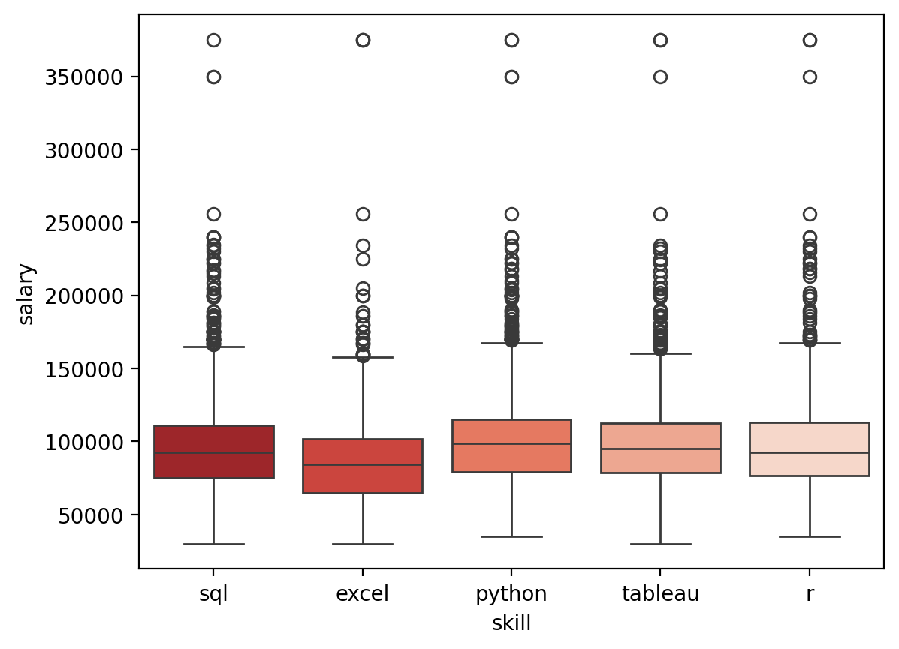
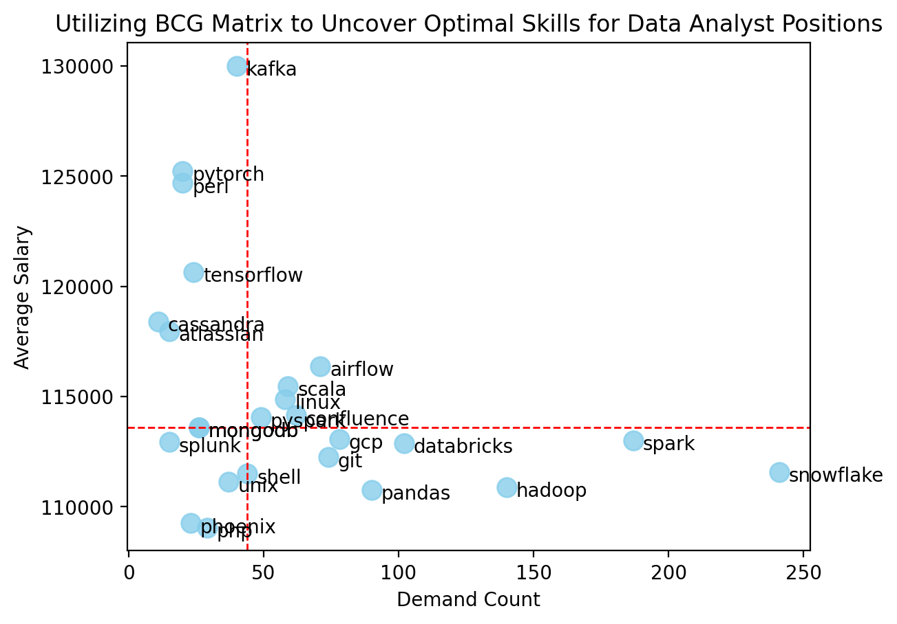

# Introduction

Explore data from job market, and focusing on data analyst roles.

As a job seeker 👩‍💻 in the realm of data analysis, you may be curious about the skills that are in high demand 📈 and come with attractive salaries 💰.

Additionally, you might be interested in learning about the skills that can elevate your skillset and pave the way for pursuing higher-paying roles in the field of data analytics.

🔍 Check out SQL queries here : [sql_query folder](/sql_query/)

# Background

To refine my SQL skill, data storytelling skill and prepare for job hunting in data analyst roles, I've discovered a project within an [online course](https://youtu.be/7mz73uXD9DA?si=f16EWPUbsigblMZy) that aligns perfectly with my goals. Special thanks to Luke Barousse, I learned a lot from your course.

Data hails from Luke Barousse's [SQL Course](https://lukebarousse.com/sql). It's packed with insights on job titles, salaries, locations, and essential skills.

> The questions I wanted to answer through my SQL queries were:

1. What are the top-paying data analyst jobs?
2. What skills are required for these top-paying jobs?
3. What skills are most in demand for data analysts?
4. Which skills are associated with higher salaries?
5. What are the most optimal skills to learn?
6. What are the salary stats for top demanded or top paying skills required for Data Analyst Jobs?

# Tools I Used

To delve into the data analyst job market, I leveraged the power of several key tools:

- **SQL:** The backbone of my analysis, allowing me to query the database and unearth critical insights.
- **PostgreSQL:** The chosen database management system, ideal for handling the job posting data.
- **Jupyter Notebook:** Using Jupyter Notebook in VS Code along with Pandas, seaborn, and Matplotlib to analyze and visualize query result data in Python.
- **Pandas:** To load and manipulate data, and then integrate with Matplotlib and seaborn for data visualization.
- **Matplotlib:** To plot bar chart.
- **seaborn:** To plot scatter plot and boxplot.
- **Visual Studio Code:** My go-to for database management and executing SQL queries.

# The Analysis

## Highlights

Before diving into step-by-step analysis, here are data graphs with insights for you to quickly capture the highlights of this project.

**1. Salary Stats Overview**

- Annual salary stats of all Data Analyst Jobs:

  | Stats              | Annual Salary (USD) |
  | ------------------ | ------------------- |
  | Q1 25th percentile | 75,000              |
  | Median             | 92,500              |
  | Q3 75th percentile | 111,478             |
  | Mean               | 96,707              |
  | Max                | 400,000             |
  | Min                | 30,000              |

- Data Analyst roles typically provide competitive salaries that can support a comfortable standard of living in the US. Besides, the 75% of jobs offer annual salary above $75,000 which is beyond U.S. median annual income $59,540 in 2023 Q4.


**2. Salary Stats of Top 5 Demanded Skills**

- The median salary (represented by the horizontal line inside each box) varies across top demanded skills, and Python appears to have the highest median salary, followed by Tableau and R.
- As a junior data analyst job seeker, being proficient in Python and Tableau could enhance your job prospects and potentially lead to better salary opportunities.



**3. Salary Stats of Top 5 Paying Skills**

- Skills relevant to big data, distributed data management and machine learning obtain high-paying jobs.
- Kafka and PyTorch have higher Q3 and mean salary among top 5 paying skills despite their median value not being the highest. Job seekers with proficiency in these skills may have access to a subset of high-paying jobs that offer competitive salaries above the median and mean of the entire job listings.


**4. Optimal Skills Analysis**

From previous highlights, we analyzed top 5 demanded and top 5 paying skills and their salary stats. Now, we look into optimal skills (top 25 paying skills that have over 10 job listings) while applying the concept of [BCG Matrix](https://www.bcg.com/about/overview/our-history/growth-share-matrix) to analyze top skills and make strategy to develop our skillset.

Among top 25 paying skills that have over 10 job listings:

> **High Demand, High Salary (Star):**\
> Airflow, Scala, Linux, Confluence, PySpark\
> **High Demand, Low Salary (Cash cow):**\
> Snowflake, Spark, Hadoop, Databricks, pandas, GCP, Git\
> **Low Demand, Low Salary (Pet):**\
> MongoDB, Splunk, Shell, Unix, phoenix, PHP\
> **Low Demand, High Salary (Question mark):**\
> Kafka, PyTorch, Perl, TensorFlow, Cassandra, Atlassian

- Despite skills like Kafka, PyTorch, Perl, TensorFlow and Cassandra tend to be high-paying, their demands on market are not as many as skills in Star and Cash cow quadrants.

- Rather than finding either top demanded skills or top paying skills, we could develop our skillset strategy to pave the career in data analysis field.

- As a junior Data Analyst, I want to prioritize which optimal skills to learn or enhance based on not only my interest but also the degree of financial stability and prospect. First, I would enhance my skills on Hadoop, pandas to get financial stability. And then, I would invest myself to extend skillset on Spark, PySpark, Snowflake and Airflow for obtaining higher paying and sought-after jobs.



**5. Skills Required for Top 10 Paying Jobs**

- Among top 10 paying jobs, Python is the most common skill and followed by Tableau, Excel, R and SQL.

- A combination of languages (Python, SQL, R), data visualization tools (Tableau, Power BI, Looker), big data tools (BigQuery, Kafka, Snowflake), and version control systems (Git, GitHub) are highly valued in data analyst roles.


## Analysis Step By Step

### 1. Top Paying Data Analyst Jobs

```sql
SELECT
    job_id,
    job_title,
    company_dim.name AS company_name,
    job_location,
    job_schedule_type,
    salary_year_avg,
    job_posted_date
FROM
    job_postings_fact
LEFT JOIN company_dim ON job_postings_fact.company_id = company_dim.company_id
WHERE
    job_title_short = 'Data Analyst' AND
    salary_year_avg IS NOT NULL
ORDER BY salary_year_avg DESC
LIMIT 10;
```

|     |  job_id | job_title                                                         | company_name                 | job_location      | job_schedule_type | salary_year_avg | job_posted_date     |
| --: | ------: | :---------------------------------------------------------------- | :--------------------------- | :---------------- | :---------------- | --------------: | :------------------ |
|   0 |  226942 | Data Analyst                                                      | Mantys                       | Anywhere          | Full-time         |          650000 | 2023-02-20 15:13:33 |
|   1 |  209315 | Data base administrator                                           | ЛАНИТ                        | Belarus           | Full-time         |          400000 | 2023-10-03 11:22:20 |
|   2 | 1110602 | HC Data Analyst , Senior                                          | Illuminate Mission Solutions | Bethesda, MD      | Full-time         |          375000 | 2023-08-18 07:00:22 |
|   3 | 1147675 | Sr Data Analyst                                                   | Illuminate Mission Solutions | Bethesda, MD      | Full-time         |          375000 | 2023-04-05 12:00:12 |
|   4 |  641501 | Head of Infrastructure Management & Data Analytics - Financial... | Citigroup, Inc               | Jacksonville, FL  | Full-time         |          375000 | 2023-07-03 11:30:01 |
|   5 |  229253 | Director of Safety Data Analysis                                  | Torc Robotics                | Austin, TX        | Full-time         |          375000 | 2023-04-21 08:01:55 |
|   6 | 1059665 | Data Analyst                                                      | Anthropic                    | San Francisco, CA | Full-time         |          350000 | 2023-06-22 07:00:59 |
|   7 |  101757 | Head of Data Analytics                                            | Care.com                     | Austin, TX        | Full-time         |          350000 | 2023-10-23 05:01:05 |
|   8 |  547382 | Director of Analytics                                             | Meta                         | Anywhere          | Full-time         |          336500 | 2023-08-23 12:04:42 |
|   9 |  894135 | Research Scientist                                                | OpenAI                       | San Francisco, CA | Full-time         |          285000 | 2023-04-19 18:04:21 |

### 2. Skills Required For Top Paying Data Analyst Jobs

```sql
WITH top_paying_jobs AS (
    SELECT
        job_id,
        job_title,
        company_dim.name AS company_name,
        salary_year_avg
    FROM
        job_postings_fact
    LEFT JOIN company_dim ON job_postings_fact.company_id = company_dim.company_id
    WHERE
        job_title_short = 'Data Analyst' AND
        salary_year_avg IS NOT NULL
    ORDER BY salary_year_avg DESC
    LIMIT 10
)

SELECT
    top_paying_jobs.*,
    skills
FROM top_paying_jobs
INNER JOIN skills_job_dim ON top_paying_jobs.job_id = skills_job_dim.job_id
INNER JOIN skills_dim ON skills_job_dim.skill_id = skills_dim.skill_id
ORDER BY salary_year_avg DESC;
```

- **Must-have skills:** Python, Tableau, Excel, R and SQL are the most common skills mentioned, indicating their significance in the field of data analysis.
- **Cloud Computing and Big Data:** Knowledge of cloud-based data warehouse solutions like BigQuery and Snowflake, along with tools for data streaming and workflow management like Kafka, Spark, and Airflow, underscores the shift towards cloud-based analytics and real-time data processing in modern data analysis roles.
- These insights suggest that a combination of languages (SQL, Python, R), data visualization tools (Tableau, Power BI, Looker), big data tools (BigQuery, Kafka, Snowflake), and version control systems (Git, GitHub) are highly valued in data analyst roles.

### 3. Top Demanded Skills For Data Analyst Jobs

```sql
SELECT
    skills,
    COUNT(job_postings_fact.job_id) AS demand_count
FROM job_postings_fact
INNER JOIN skills_job_dim ON job_postings_fact.job_id = skills_job_dim.job_id
INNER JOIN skills_dim ON skills_job_dim.skill_id = skills_dim.skill_id
WHERE
    job_title_short = 'Data Analyst'
GROUP BY skills
ORDER BY demand_count DESC
LIMIT 5;
```

|     | skills   | demand_count |
| --: | :------- | -----------: |
|   0 | sql      |        92628 |
|   1 | excel    |        67031 |
|   2 | python   |        57326 |
|   3 | tableau  |        46554 |
|   4 | power bi |        39468 |

- The top 5 skills with the highest demand for data analysts encompass a mix of technical and analytical capabilities, including proficiency in querying languages (SQL), data manipulation tools (Excel), programming languages (Python), and data visualization platforms (Tableau, Power BI).

### 4. Top Paying Skills For Data Analyst Jobs

```sql
SELECT
    skills AS skill,
    ROUND(AVG(salary_year_avg), 0) AS avg_salary,
    COUNT(job_postings_fact.job_id) AS demand_count
FROM job_postings_fact
INNER JOIN skills_job_dim ON job_postings_fact.job_id = skills_job_dim.job_id
INNER JOIN skills_dim ON skills_job_dim.skill_id = skills_dim.skill_id
WHERE
    salary_year_avg IS NOT NULL AND
    job_title_short = 'Data Analyst'
GROUP BY skill
ORDER BY avg_salary DESC
LIMIT 25;
```

|     | skill        | avg_salary | demand_count |
| --: | :----------- | ---------: | -----------: |
|   0 | svn          |     400000 |            1 |
|   1 | solidity     |     179000 |            1 |
|   2 | couchbase    |     160515 |            1 |
|   3 | datarobot    |     155486 |            1 |
|   4 | golang       |     155000 |            2 |
|   5 | mxnet        |     149000 |            2 |
|   6 | dplyr        |     147633 |            3 |
|   7 | vmware       |     147500 |            1 |
|   8 | terraform    |     146734 |            3 |
|   9 | twilio       |     138500 |            2 |
|  10 | gitlab       |     134126 |            7 |
|  11 | kafka        |     129999 |           40 |
|  12 | puppet       |     129820 |            2 |
|  13 | keras        |     127013 |            3 |
|  14 | pytorch      |     125226 |           20 |
|  15 | perl         |     124686 |           20 |
|  16 | ansible      |     124370 |            2 |
|  17 | hugging face |     123950 |            2 |
|  18 | tensorflow   |     120647 |           24 |
|  19 | cassandra    |     118407 |           11 |
|  20 | notion       |     118092 |            6 |
|  21 | atlassian    |     117966 |           15 |
|  22 | bitbucket    |     116712 |            6 |
|  23 | airflow      |     116387 |           71 |
|  24 | scala        |     115480 |           59 |

- **Specialized and Emerging Technologies:** High-paying skills like Solidity, DataRobot, mxnet, and GoLang indicate a demand for expertise in specialized and emerging technologies, reflecting industry adoption of new tools.
- **Convergence of Data Analysis and DevOps:** Skills in infrastructure management (Terraform, VMware), automation (Puppet, Ansible), and version control (GitLab, Bitbucket) suggest a merging of data analysis and DevOps practices, emphasizing the importance of efficient workflows.
- **Focus on Machine Learning, Big Data, and Collaboration:** The presence of ML frameworks (Keras, PyTorch, TensorFlow), big data platforms (Kafka, Cassandra), and collaboration tools (Notion, Atlassian) underscores the importance of skills in AI, big data processing, and collaboration platforms for modern data analysts.

### 5. Top 25 Optimal Skills For Data Analyst Jobs

```sql
SELECT
    skills_dim.skill_id AS skill_id,
    skills_dim.skills AS skill,
    COUNT(job_postings_fact.job_id) AS demand_count,
    ROUND(AVG(salary_year_avg), 0) AS avg_salary
FROM job_postings_fact
INNER JOIN skills_job_dim ON job_postings_fact.job_id = skills_job_dim.job_id
INNER JOIN skills_dim ON skills_job_dim.skill_id = skills_dim.skill_id
WHERE
    salary_year_avg IS NOT NULL AND
    job_title_short = 'Data Analyst'
GROUP BY
    skills_dim.skill_id
HAVING COUNT(job_postings_fact.job_id) > 10
ORDER BY
    avg_salary DESC,
    demand_count DESC
LIMIT 25;
```

|     | skill_id | skill      | demand_count | avg_salary |
| --: | -------: | :--------- | -----------: | ---------: |
|   0 |       98 | kafka      |           40 |     129999 |
|   1 |      101 | pytorch    |           20 |     125226 |
|   2 |       31 | perl       |           20 |     124686 |
|   3 |       99 | tensorflow |           24 |     120647 |
|   4 |       63 | cassandra  |           11 |     118407 |
|   5 |      219 | atlassian  |           15 |     117966 |
|   6 |       96 | airflow    |           71 |     116387 |
|   7 |        3 | scala      |           59 |     115480 |
|   8 |      169 | linux      |           58 |     114883 |
|   9 |      234 | confluence |           62 |     114153 |
|  10 |       95 | pyspark    |           49 |     114058 |
|  11 |       18 | mongodb    |           26 |     113608 |
|  12 |       62 | mongodb    |           26 |     113608 |
|  13 |       81 | gcp        |           78 |     113065 |
|  14 |       92 | spark      |          187 |     113002 |
|  15 |      193 | splunk     |           15 |     112928 |
|  16 |       75 | databricks |          102 |     112881 |
|  17 |      210 | git        |           74 |     112250 |
|  18 |       80 | snowflake  |          241 |     111578 |
|  19 |        6 | shell      |           44 |     111496 |
|  20 |      168 | unix       |           37 |     111123 |
|  21 |       97 | hadoop     |          140 |     110888 |
|  22 |       93 | pandas     |           90 |     110767 |
|  23 |      137 | phoenix    |           23 |     109259 |
|  24 |       25 | php        |           29 |     109052 |

**1. Emergence of Big Data Technologies:**

- High-demand skills such as Kafka, PyTorch, TensorFlow, and Apache Hadoop signify the increasing importance of big data technologies in data analysis roles.
- Companies are actively seeking professionals proficient in these tools to handle large volumes of data and derive valuable insights.

**2. Cloud Computing and Data Management:**

- Skills related to cloud platforms like GCP (Google Cloud Platform), Snowflake, and Databricks are in high demand, indicating the shift towards cloud-based data management and analytics solutions.
- Organizations are leveraging cloud services for scalable storage, processing, and analysis of data, leading to increased demand for professionals with expertise in cloud-based analytics tools.

**3. Automation and Workflow Management:**

- Tools such as Airflow, Git, and Atlassian are indicative of the growing need for automation and efficient workflow management in data analysis processes.
- Companies are seeking candidates who can streamline data pipelines, automate repetitive tasks, and collaborate effectively within teams using version control and project management tools.

Overall, the trends suggest a strong emphasis on advanced analytics, big data technologies, cloud computing, and automation in data analyst roles, reflecting the evolving needs of organizations to derive insights and make data-driven decisions efficiently.

### 6. Salary Stats of Top Demanded or Top Paying Skills For Data Analyst Jobs

```sql
WITH top_skills_table AS(
    SELECT
        sub_query.*,
        ROW_NUMBER() OVER(ORDER BY demand_count DESC) AS index_dcount,
        NTILE(100) OVER(ORDER BY demand_count DESC) AS percentile_by_demand_count,
        ROW_NUMBER() OVER(ORDER BY avg_salary DESC) AS index_asalary,
        NTILE(100) OVER(ORDER BY avg_salary DESC) AS percentile_by_avg_salary
    FROM (
        SELECT
            skills_dim.skills AS skill,
            COUNT(job_postings_fact.job_id) AS demand_count,
            ROUND(AVG(salary_year_avg), 0) AS avg_salary,
            ROUND(MIN(salary_year_avg), 0) AS min_salary,
            ROUND(MAX(salary_year_avg), 0) AS max_salary,
            PERCENTILE_CONT(0.5) WITHIN GROUP (ORDER BY salary_year_avg) AS median_salary
        FROM job_postings_fact
        INNER JOIN skills_job_dim ON job_postings_fact.job_id = skills_job_dim.job_id
        INNER JOIN skills_dim ON skills_job_dim.skill_id = skills_dim.skill_id
        WHERE
            salary_year_avg IS NOT NULL AND
            job_title_short = 'Data Analyst'
        GROUP BY
            skill
        HAVING
            COUNT(job_postings_fact.job_id) > 10
    ) AS sub_query
)

SELECT *
FROM top_skills_table
WHERE percentile_by_demand_count <=10 OR percentile_by_avg_salary <=10
ORDER BY demand_count DESC;
```

|     | skill      | demand_count | avg_salary | min_salary | max_salary | median_salary | index_dcount | percentile_by_demand_count | index_asalary | percentile_by_avg_salary |
| --: | :--------- | -----------: | ---------: | ---------: | ---------: | ------------: | -----------: | -------------------------: | ------------: | -----------------------: |
|   0 | sql        |         3083 |      96435 |      30000 |     375000 |         92500 |            1 |                          1 |            69 |                       67 |
|   1 | excel      |         2143 |      86419 |      30000 |     375000 |         84500 |            2 |                          1 |            87 |                       85 |
|   2 | python     |         1840 |     101512 |      35000 |     375000 |         98500 |            3 |                          2 |            48 |                       46 |
|   3 | tableau    |         1659 |      97978 |      30000 |     375000 |         95000 |            4 |                          2 |            64 |                       62 |
|   4 | r          |         1073 |      98708 |      35000 |     375000 |       92527.5 |            5 |                          3 |            62 |                       60 |
|   5 | power bi   |         1044 |      92324 |      30000 |     375000 |         90000 |            6 |                          4 |            76 |                       74 |
|   6 | sas        |         1000 |      93707 |      41447 |     375000 |         90000 |            7 |                          5 |            74 |                       72 |
|   7 | word       |          527 |      82941 |      30000 |     375000 |         80850 |            8 |                          6 |            97 |                       95 |
|   8 | powerpoint |          524 |      88316 |      30000 |     255830 |         85000 |            9 |                          7 |            83 |                       81 |
|   9 | sql server |          336 |      96191 |      44100 |     185000 |         92500 |           10 |                          8 |            70 |                       68 |
|  10 | oracle     |          332 |     100964 |      40000 |     400000 |       95588.2 |           11 |                          9 |            53 |                       51 |
|  11 | azure      |          319 |     105400 |      32400 |     255830 |        100000 |           12 |                         10 |            38 |                       36 |
|  12 | airflow    |           71 |     116387 |      51014 |     375000 |        111175 |           49 |                         47 |             7 |                        5 |
|  13 | confluence |           62 |     114153 |      57500 |     189309 |        111175 |           54 |                         52 |            10 |                        8 |
|  14 | scala      |           59 |     115480 |      50000 |     234000 |        111175 |           56 |                         54 |             8 |                        6 |
|  15 | linux      |           58 |     114883 |      50000 |     400000 |        112150 |           58 |                         56 |             9 |                        7 |
|  16 | mongodb    |           52 |     113608 |      48000 |     204585 |        111838 |           61 |                         59 |            12 |                       10 |
|  17 | pyspark    |           49 |     114058 |      53014 |     255830 |        111175 |           62 |                         60 |            11 |                        9 |
|  18 | kafka      |           40 |     129999 |      51014 |     400000 |        115095 |           66 |                         64 |             1 |                        1 |
|  19 | tensorflow |           24 |     120647 |      77500 |     198000 |        105000 |           82 |                         80 |             4 |                        2 |
|  20 | pytorch    |           20 |     125226 |      70000 |     220000 |        107000 |           86 |                         84 |             2 |                        1 |
|  21 | perl       |           20 |     124686 |      56700 |     186500 |        119550 |           87 |                         85 |             3 |                        2 |
|  22 | atlassian  |           15 |     117966 |      65000 |     190000 |        102500 |           94 |                         92 |             6 |                        4 |
|  23 | cassandra  |           11 |     118407 |      53014 |     204585 |        111175 |          102 |                        100 |             5 |                        3 |

# What I Learned

Throughout this journey, I have turbocharged my SQL and Python skills.

- **🧮Complex Query:** Leveraged advanced SQL query by merging tables, using CTE, subquery and aggregate functions like a pro to get meaningful data.

- **📊Data Storytelling:** Mastered the art of data visualization, combining statistics and referencing BCG Growth Share Matrix to deliver insightful data graphs.

- **🪄Analytical Wizardry:** Leveled up my problem-solving skills by turing questions into actionable insights.

# Conclusions

This project enhanced my SQL, Python skills and provided valuable insights into the data analysts job market. The [highlights](#Highlights) part serve as a guide to prioritizing skills to learn and making your own skillset portfolio strategy. This data exploration project indicates that continous learning and adaption to emerging trends is the key to pave better career in data analysis field.
